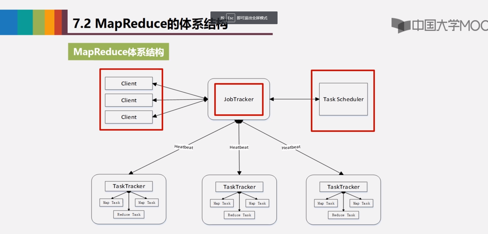

#### MapReduce 介绍

MapReduce 是一种分布式的离线计算框架，是一种计算框架，用于大规模的数据采集（大于1TB）的并行运算。

将自己的程序运行再分布式的系统上。概念是 Map（映射）和 Reduce（规约）

指定一个 Map 函数，用来把一组键值对映射成一组新的键值对，指定并发的 Reduce(规约)函数，用来保证所有映射的键值对中的每一个共享相同的键组

可以用于大规模的算法图形处理，文字处理

#### MapReduce 的设计理念

1. 分布式计算

   分布式计算将该应用分解成多个小的部分，分配给多台计算机节点进行处理，这样可以节约整体的计算时间，大大提高计算效率

2. 移动计算，而不是移动数据

   将计算程序应用移动到具有数据的集群计算机节点上进行计算操作，而不是把数据呐过来

#### MapReduce 计算框架的组成（概览）

主要有这么几个阶段

- 输入数据

这个输入数据就是，每一个 DataNode 上面的 block 块

- 拆分 （splits） 

输入到 MapReduce 的数据，首先被切分成固定大小的片段叫做 input splits ，一个片段对应着一个 map

一般来说会把一个 block 当作一个 片段

- 映射（Mapping） 给它一堆键值对，输出新的键值对

==map的数量就是上面分段的数量==   ==maping是在有数据 DataNode 上面跑==

这是我们的 MapReduce 程序执行的第一个个阶段，在这个阶段中，传递给 map 的片段里面的数据，就会被映射成键值对，比如 计算（某个单词出现的个数），具体是什么键值对，就由我们具体的代码实现。

这里有一个缓存区的概念，每次 map输出的东西会先保存到缓存区里面，当缓冲区超过80%后，就会缓冲区里面的数据写到磁盘里面（不是 HDFS），然后缓冲区继续使用，当map跑完以后，就会把缓冲区文件合并

- 混洗 （shuffle）

==shuffle 是在 map和reduce中间的一个阶段，可以把它归为reduce阶段==

shuffle 可以把 map 阶段输出的值，按照某种 key 值，重新的切分和组合（比如把相同的东西放到一起），把key值符合某种范围的输出送到特定的reduce那里去处理

它可以简化 reduce 的过程

#### 输入与输出

- Map 阶段

输入 <key,value>    <'行号','a b c'>

输出 <newkey, newvalue>   <a,1>  <b,1>  <c,1>

- reduce 阶段

输入 <key, value-list>   <a,

输出 <key, value>

#### Mapreduce 体系架构

采用的是主从架构 master/slave

##### client 客户端

- 通过 client 可以提交用户编写的应用程序，通过它将应用程序提交到 JobTracker (ResourceManager)
- 用户可以通过 client 提供的接口，查询到当前作业的运行状态  （我们提交的应用程序会被表现为作业的形式），一个作业通常有多个 task

##### JobTracker 作业跟踪器 ( ResourceManager ) （主 master ）

- 负责资源的监控和作业的调度
- 监控底层的其他的 task tracker 以及当前运行的 job 的健康状态
- 一旦探测到失败的情况，就把这个任务转移到其他的节点上继续执行，跟踪任务的执行进度和资源使用量（appMaster 汇报的 ），

##### TaskTracker 任务调度器 （NodeManage） （从 slave）

- 执行具体的相关任务，一般接收 JobTracker 发送的命令
- 把自己的一些资源使用情况，以及任务的运行进度通过心跳的方式，也就是 heartbeat发送给 JobTracker

##### Task 任务

map 任务：map 函数

reduce 任务：reduce 函数